<div align="center">

# ⚽ Futbolcu Bilgi Sistemi

### *Dünya yıldızlarının bilgilerine tek tıkla ulaşın!*


</div>

---

## 🎯 Nedir?

Dünya futbolunun en ünlü 30 oyuncusunun detaylı bilgilerini gösteren **Windows Forms** uygulaması.

<div align="center">

### ⚡ Hızlı Bakış

| 🎮 Özellik | 📝 Açıklama |
|-----------|------------|
| **30+ Oyuncu** | Messi, Ronaldo, Haaland, Mbappé ve daha fazlası |
| **Detaylı Bilgi** | Yaş, takım, mevki, piyasa değeri |
| **Türk Yıldızlar** | Güler, Yıldız, Çalhanoğlu, Gündoğan |
| **Kolay Kullanım** | Tek tıkla oyuncu bilgileri |

</div>

---

## 🌟 Özellikler

```
✨ 30+ Dünya Yıldızı        🖼️ Oyuncu Fotoğrafları
📊 Piyasa Değerleri         🇹🇷 Türk Futbolcular  
⚡ Hızlı Erişim             🎨 Modern Arayüz
```

---


## 🎮 Nasıl Kullanılır?

```mermaid
graph LR
    A[🏠 Ana Ekran] -->|Oyuncu Seç| B[👤 Detay Ekranı]
    B -->|Geri| A
    style A fill:#4CAF50
    style B fill:#2196F3
```

<div align="center">



</div>

1. **Uygulamayı aç** → Ana ekranda 30 futbolcu görünür
2. **Oyuncu seç** → İstediğin futbolcuya tıkla  
3. **Bilgileri gör** → Ad, yaş, takım, piyasa değeri
4. **Geri dön** → Ana ekrana dön

---

## ⚽ Futbolcular

<div align="center">

### 🌟 Süper Yıldızlar

| Oyuncu | Takım | Değer |
|--------|-------|-------|
| 🇵🇹 **Ronaldo** | Al Nassr | 12M € |
| 🇦🇷 **Messi** | Inter Miami | 15M € |
| 🇫🇷 **Mbappé** | Real Madrid | 200M € |
| 🇳🇴 **Haaland** | Man City | 200M € |

### 🇹🇷 Türk Yıldızlar

| Oyuncu | Takım | Değer |
|--------|-------|-------|
| **Arda Güler** | Real Madrid | 90M € |
| **Kenan Yıldız** | Juventus | 75M € |
| **Çalhanoğlu** | Inter Milan | 22M € |
| **Gündoğan** | Galatasaray | 3M € |

</div>

**+22 oyuncu daha:** Kane, Yamal, Osimhen, Rice, Foden, De Bruyne...

---

## 🛠️ Teknolojiler

<div align="center">


**C#** • **Windows Forms** • **.NET Framework 4.7.2**

</div>

---

## 📸 Demo

<div align="center">

### Ana Ekran
*30 futbolcunun listelendiği seçim ekranı*


### Detay Ekranı  
*Seçilen oyuncunun tüm bilgileri*


</div>

---

## � Geliştirme Fikirleri


<div align="center">


[](https://github.com/username)
[](https://linkedin.com/in/username)


</div>
